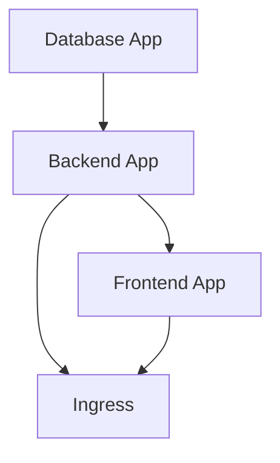
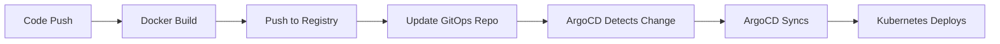

# E-Commerce Application Architecture Plan

## Overview
ArgoCD-ready e-commerce application with microservices architecture, featuring a React frontend, Node.js/Express backend, and PostgreSQL database.

## Technology Stack

### Frontend
- **Framework**: React 18
- **Build Tool**: Vite
- **State Management**: React Context API / Redux Toolkit
- **HTTP Client**: Axios
- **UI Library**: Material-UI or Tailwind CSS
- **Container**: Nginx (production)

### Backend
- **Runtime**: Node.js 20 LTS
- **Framework**: Express.js
- **ORM**: Sequelize or Prisma
- **Authentication**: JWT
- **Validation**: Joi or Zod
- **API Documentation**: Swagger/OpenAPI

### Database
- **Database**: PostgreSQL 15
- **Connection Pooling**: pg-pool
- **Migrations**: Sequelize migrations or Prisma migrate

### Infrastructure
- **Container Orchestration**: Kubernetes
- **GitOps**: ArgoCD
- **Ingress Controller**: Nginx Ingress
- **Container Registry**: Docker Hub / GitHub Container Registry

## Project Structure

```
argo-app/
├── frontend/
│   ├── src/
│   │   ├── components/
│   │   ├── pages/
│   │   ├── services/
│   │   ├── context/
│   │   └── App.jsx
│   ├── public/
│   ├── Dockerfile
│   ├── nginx.conf
│   ├── package.json
│   └── vite.config.js
├── backend/
│   ├── src/
│   │   ├── controllers/
│   │   ├── models/
│   │   ├── routes/
│   │   ├── middleware/
│   │   ├── config/
│   │   └── server.js
│   ├── Dockerfile
│   ├── package.json
│   └── .env.example
├── gitops/
│   ├── base/
│   │   ├── backend/
│   │   │   ├── deployment.yaml
│   │   │   ├── service.yaml
│   │   │   └── configmap.yaml
│   │   ├── frontend/
│   │   │   ├── deployment.yaml
│   │   │   ├── service.yaml
│   │   │   └── configmap.yaml
│   │   └── database/
│   │       ├── statefulset.yaml
│   │       ├── service.yaml
│   │       ├── pvc.yaml
│   │       └── secret.yaml
│   ├── overlays/
│   │   ├── dev/
│   │   │   ├── kustomization.yaml
│   │   │   └── ingress.yaml
│   │   ├── staging/
│   │   │   ├── kustomization.yaml
│   │   │   └── ingress.yaml
│   │   └── prod/
│   │       ├── kustomization.yaml
│   │       └── ingress.yaml
│   └── argocd/
│       ├── backend-app.yaml
│       ├── frontend-app.yaml
│       └── database-app.yaml
├── docs/
│   ├── API.md
│   └── DEPLOYMENT.md
└── README.md
```

## Database Schema

### Tables

#### products
- id (UUID, PRIMARY KEY)
- name (VARCHAR(255), NOT NULL)
- description (TEXT)
- price (DECIMAL(10,2), NOT NULL)
- stock_quantity (INTEGER, NOT NULL)
- image_url (VARCHAR(500))
- category (VARCHAR(100))
- created_at (TIMESTAMP)
- updated_at (TIMESTAMP)

#### users
- id (UUID, PRIMARY KEY)
- email (VARCHAR(255), UNIQUE, NOT NULL)
- password_hash (VARCHAR(255), NOT NULL)
- first_name (VARCHAR(100))
- last_name (VARCHAR(100))
- created_at (TIMESTAMP)
- updated_at (TIMESTAMP)

#### orders
- id (UUID, PRIMARY KEY)
- user_id (UUID, FOREIGN KEY → users.id)
- total_amount (DECIMAL(10,2), NOT NULL)
- status (ENUM: pending, processing, shipped, delivered, cancelled)
- shipping_address (TEXT)
- created_at (TIMESTAMP)
- updated_at (TIMESTAMP)

#### order_items
- id (UUID, PRIMARY KEY)
- order_id (UUID, FOREIGN KEY → orders.id)
- product_id (UUID, FOREIGN KEY → products.id)
- quantity (INTEGER, NOT NULL)
- price_at_purchase (DECIMAL(10,2), NOT NULL)
- created_at (TIMESTAMP)

#### cart_items
- id (UUID, PRIMARY KEY)
- user_id (UUID, FOREIGN KEY → users.id)
- product_id (UUID, FOREIGN KEY → products.id)
- quantity (INTEGER, NOT NULL)
- created_at (TIMESTAMP)
- updated_at (TIMESTAMP)

## API Endpoints

### Products
- `GET /api/products` - List all products (with pagination)
- `GET /api/products/:id` - Get product details
- `GET /api/products/category/:category` - Filter by category
- `POST /api/products` - Create product (admin)
- `PUT /api/products/:id` - Update product (admin)
- `DELETE /api/products/:id` - Delete product (admin)

### Authentication
- `POST /api/auth/register` - User registration
- `POST /api/auth/login` - User login
- `POST /api/auth/logout` - User logout
- `GET /api/auth/me` - Get current user

### Cart
- `GET /api/cart` - Get user's cart
- `POST /api/cart/items` - Add item to cart
- `PUT /api/cart/items/:id` - Update cart item quantity
- `DELETE /api/cart/items/:id` - Remove item from cart
- `DELETE /api/cart` - Clear cart

### Orders
- `GET /api/orders` - Get user's orders
- `GET /api/orders/:id` - Get order details
- `POST /api/orders` - Create order from cart
- `PUT /api/orders/:id/status` - Update order status (admin)

## Frontend Components

### Pages
- **HomePage**: Product listing with categories and search
- **ProductDetailPage**: Individual product view
- **CartPage**: Shopping cart management
- **CheckoutPage**: Order placement
- **OrdersPage**: Order history
- **LoginPage**: User authentication
- **RegisterPage**: User registration
- **AdminDashboard**: Product management (admin)

### Components
- **Navbar**: Navigation with cart icon and user menu
- **ProductCard**: Product display card
- **ProductList**: Grid of products
- **CartItem**: Individual cart item
- **OrderSummary**: Order details display
- **SearchBar**: Product search
- **CategoryFilter**: Category selection
- **ProtectedRoute**: Authentication guard

## Kubernetes Configuration Strategy

### ConfigMaps
Environment-specific configurations (non-sensitive):
- API URLs
- Feature flags
- Application settings
- Database connection parameters (host, port, database name)

### Secrets
Sensitive data (base64 encoded):
- Database credentials (username, password)
- JWT secret keys
- API keys

### Environment Variables Pattern
```yaml
env:
  - name: NODE_ENV
    value: "production"
  - name: DATABASE_HOST
    valueFrom:
      configMapKeyRef:
        name: backend-config
        key: database.host
  - name: DATABASE_PASSWORD
    valueFrom:
      secretKeyRef:
        name: postgres-secret
        key: password
  - name: API_URL
    valueFrom:
      configMapKeyRef:
        name: frontend-config
        key: api.url
```

## ArgoCD Application Structure

### Application Sync Strategy
- **Sync Policy**: Automated with self-heal enabled
- **Prune**: Enabled (remove resources not in Git)
- **Self Heal**: Enabled (revert manual changes)

### Application Dependencies


### Kustomize Overlays
- **base/**: Common configurations shared across environments
- **overlays/dev/**: Development-specific settings (single replica, debug mode)
- **overlays/staging/**: Staging environment (2 replicas, staging domain)
- **overlays/prod/**: Production settings (3+ replicas, production domain, resource limits)

## Deployment Flow



## Configuration Management

### Backend Configuration
```javascript
// config/database.js
module.exports = {
  host: process.env.DATABASE_HOST || 'localhost',
  port: process.env.DATABASE_PORT || 5432,
  database: process.env.DATABASE_NAME || 'ecommerce',
  username: process.env.DATABASE_USER || 'postgres',
  password: process.env.DATABASE_PASSWORD || 'password'
};

// config/app.js
module.exports = {
  port: process.env.PORT || 3000,
  jwtSecret: process.env.JWT_SECRET,
  nodeEnv: process.env.NODE_ENV || 'development'
};
```

### Frontend Configuration
```javascript
// src/config/api.js
export const API_BASE_URL = window.ENV?.API_URL || 
  import.meta.env.VITE_API_URL || 
  'http://localhost:3000';
```

### Nginx Configuration for Frontend
```nginx
server {
  listen 80;
  root /usr/share/nginx/html;
  index index.html;

  # Inject environment variables
  location /env.js {
    default_type application/javascript;
    return 200 'window.ENV = { API_URL: "$API_URL" };';
  }

  # SPA routing
  location / {
    try_files $uri $uri/ /index.html;
  }
}
```

## Resource Requirements

### Development Environment
- **Backend**: 256Mi memory, 0.1 CPU
- **Frontend**: 128Mi memory, 0.1 CPU
- **Database**: 512Mi memory, 0.2 CPU, 1Gi storage

### Production Environment
- **Backend**: 512Mi-1Gi memory, 0.5-1 CPU, 3 replicas
- **Frontend**: 256Mi-512Mi memory, 0.2-0.5 CPU, 3 replicas
- **Database**: 2Gi-4Gi memory, 1-2 CPU, 20Gi storage

## Health Checks

### Backend
- **Liveness**: `GET /health/live`
- **Readiness**: `GET /health/ready` (checks DB connection)

### Frontend
- **Liveness**: `GET /`
- **Readiness**: `GET /`

### Database
- **Liveness**: `pg_isready`
- **Readiness**: Connection test

## Security Considerations

1. **Secrets Management**: Use Kubernetes Secrets, never commit sensitive data
2. **CORS**: Configure proper CORS policies in backend
3. **Authentication**: JWT-based authentication with secure token storage
4. **HTTPS**: Use TLS certificates via cert-manager
5. **Network Policies**: Restrict pod-to-pod communication
6. **Image Security**: Use official base images, scan for vulnerabilities
7. **RBAC**: Proper Kubernetes RBAC for ArgoCD

## Monitoring & Logging

### Recommended Tools
- **Metrics**: Prometheus + Grafana
- **Logging**: EFK Stack (Elasticsearch, Fluentd, Kibana)
- **Tracing**: Jaeger or Zipkin
- **Health Checks**: Kubernetes probes

### Application Logging
- Structured JSON logging
- Log levels: ERROR, WARN, INFO, DEBUG
- Request/response logging with correlation IDs

## Next Steps

1. Review and approve this architecture plan
2. Clarify any requirements or preferences
3. Switch to Code/Advanced mode to implement the solution
4. Create Docker images for frontend and backend
5. Set up Kubernetes manifests
6. Configure ArgoCD applications
7. Test deployment in local Kubernetes cluster
8. Document deployment procedures