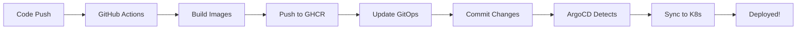

# CI/CD Setup Guide

This guide explains how to set up the automated CI/CD pipeline for the e-commerce application using GitHub Actions and ArgoCD.

## 🔄 Pipeline Overview

The CI/CD pipeline automatically:
1. **Detects changes** in backend or frontend code
2. **Generates semantic versions** based on commit count
3. **Builds Docker images** for changed components
4. **Pushes images** to GitHub Container Registry (GHCR)
5. **Updates GitOps manifests** with new image tags
6. **Creates GitHub releases** with deployment information
7. **ArgoCD automatically syncs** the changes to Kubernetes

## 📋 Prerequisites

### 1. GitHub Repository Setup

1. **Create a GitHub repository** for your project
2. **Generate package-lock.json files** (required for Docker builds):
   ```bash
   cd backend && npm install --package-lock-only && cd ..
   cd frontend && npm install --package-lock-only && cd ..
   ```
3. **Push your code** to the repository (including package-lock.json files)
4. **Enable GitHub Actions** (enabled by default)

### 2. GitHub Container Registry (GHCR)

GitHub Container Registry is automatically available for your repository. No additional setup needed!

### 3. Repository Secrets

No additional secrets are required! The workflow uses `GITHUB_TOKEN` which is automatically provided.

### 4. Update Configuration

Edit `gitops/overlays/dev/kustomization.yaml` and replace `YOUR_GITHUB_USERNAME` with your actual GitHub username:

```yaml
images:
  - name: ecommerce-backend
    newName: ghcr.io/YOUR_GITHUB_USERNAME/argo-app/backend
    newTag: latest
  - name: ecommerce-frontend
    newName: ghcr.io/YOUR_GITHUB_USERNAME/argo-app/frontend
    newTag: latest
```

## 🚀 How It Works

### Workflow Triggers

The pipeline runs on:
- **Push to main/master branch**: Full build and deployment
- **Pull requests**: Build only (no deployment)

### Version Generation

Versions are automatically generated using the format: `v1.0.COMMIT_COUNT`

Example: `v1.0.42` (42nd commit on main branch)

### Change Detection

The pipeline intelligently detects which components changed:
- Only builds backend if `backend/**` files changed
- Only builds frontend if `frontend/**` files changed
- Updates only the changed component's image tag

### Image Tagging Strategy

Each build creates multiple tags:
- `v1.0.X` - Semantic version
- `latest` - Always points to the latest build
- `main-SHA` - Branch name + commit SHA

## 📦 GitHub Container Registry

### Viewing Images

1. Go to your GitHub repository
2. Click on "Packages" in the right sidebar
3. You'll see `backend` and `frontend` packages

### Making Images Public (Optional)

By default, images are private. To make them public:

1. Go to the package page
2. Click "Package settings"
3. Scroll to "Danger Zone"
4. Click "Change visibility" → "Public"

### Pulling Images

```bash
# Login to GHCR (if private)
echo $GITHUB_TOKEN | docker login ghcr.io -u USERNAME --password-stdin

# Pull images
docker pull ghcr.io/USERNAME/argo-app/backend:v1.0.1
docker pull ghcr.io/USERNAME/argo-app/frontend:v1.0.1
```

## ⚙️ ArgoCD Configuration

### 1. Install ArgoCD

```bash
kubectl create namespace argocd
kubectl apply -n argocd -f https://raw.githubusercontent.com/argoproj/argo-cd/stable/manifests/install.yaml
```

### 2. Access ArgoCD UI

```bash
# Port forward
kubectl port-forward svc/argocd-server -n argocd 8080:443

# Get admin password
kubectl -n argocd get secret argocd-initial-admin-secret -o jsonpath="{.data.password}" | base64 -d
```

Access at: https://localhost:8080

### 3. Configure Repository Access

If your repository is private, add credentials:

```bash
argocd repo add https://github.com/USERNAME/argo-app.git \
  --username YOUR_USERNAME \
  --password YOUR_GITHUB_TOKEN
```

### 4. Create ArgoCD Application

Update `gitops/argocd/application.yaml` with your repository URL:

```yaml
spec:
  source:
    repoURL: https://github.com/YOUR_USERNAME/argo-app.git
```

Then apply:

```bash
kubectl apply -f gitops/argocd/application.yaml
```

### 5. Configure Image Pull Secrets (if private images)

```bash
kubectl create secret docker-registry ghcr-secret \
  --docker-server=ghcr.io \
  --docker-username=YOUR_USERNAME \
  --docker-password=YOUR_GITHUB_TOKEN \
  --docker-email=YOUR_EMAIL \
  -n ecommerce-dev
```

Add to deployments:

```yaml
spec:
  template:
    spec:
      imagePullSecrets:
        - name: ghcr-secret
```

## 🔄 Deployment Flow



### Step-by-Step Flow

1. **Developer pushes code** to main/master branch
2. **GitHub Actions triggers** the CI/CD workflow
3. **Version is generated** (e.g., v1.0.42)
4. **Changes are detected** (backend/frontend)
5. **Docker images are built** for changed components
6. **Images are pushed** to GHCR with version tags
7. **Kustomization file is updated** with new image tags
8. **Changes are committed** back to the repository
9. **GitHub release is created** with deployment info
10. **ArgoCD detects the change** (within 3 minutes by default)
11. **ArgoCD syncs** the new images to Kubernetes
12. **Application is updated** with zero downtime

## 📊 Monitoring Deployments

### GitHub Actions

View workflow runs:
```
https://github.com/USERNAME/argo-app/actions
```

### ArgoCD

```bash
# Check application status
argocd app get ecommerce-dev

# View sync history
argocd app history ecommerce-dev

# Manual sync (if needed)
argocd app sync ecommerce-dev
```

### Kubernetes

```bash
# Check pod status
kubectl get pods -n ecommerce-dev

# View deployment rollout
kubectl rollout status deployment/backend -n ecommerce-dev
kubectl rollout status deployment/frontend -n ecommerce-dev

# View recent events
kubectl get events -n ecommerce-dev --sort-by='.lastTimestamp'
```

## 🐛 Troubleshooting

### Build Failures

**Check GitHub Actions logs:**
1. Go to Actions tab
2. Click on the failed workflow
3. Expand the failed step

**Common issues:**

#### 1. `npm ci` Failed - Missing package-lock.json

**Error:**
```
ERROR: failed to solve: process "/bin/sh -c npm ci" did not complete successfully: exit code: 1
```

**Solution:**
Generate package-lock.json files:
```bash
cd backend && npm install --package-lock-only && cd ..
cd frontend && npm install --package-lock-only && cd ..
git add backend/package-lock.json frontend/package-lock.json
git commit -m "Add package-lock.json files"
git push
```

#### 2. Permission Denied - Unable to Push to Repository

**Error:**
```
remote: Permission to USERNAME/argo-app.git denied to github-actions[bot].
fatal: unable to access 'https://github.com/USERNAME/argo-app/': The requested URL returned error: 403
```

**Solution:**
The workflow needs write permissions. This is already fixed in the workflow file with:
```yaml
permissions:
  contents: write
  packages: write
  pull-requests: write
```

If you still see this error, ensure:
1. GitHub Actions is enabled in your repository settings
2. Workflow permissions are set to "Read and write permissions" in Settings → Actions → General → Workflow permissions

#### 3. Docker build errors

**Solution:**
- Check Dockerfile syntax
- Test failures: Fix failing tests
- Permission errors: Check repository settings

### Image Pull Errors

**Error: `ImagePullBackOff`**

```bash
# Check image pull secret
kubectl get secret ghcr-secret -n ecommerce-dev

# Verify image exists
docker pull ghcr.io/USERNAME/argo-app/backend:v1.0.1

# Check pod events
kubectl describe pod POD_NAME -n ecommerce-dev
```

### ArgoCD Sync Issues

**Application out of sync:**

```bash
# Force sync
argocd app sync ecommerce-dev --force

# Refresh application
argocd app refresh ecommerce-dev

# Check sync status
argocd app get ecommerce-dev
```

### Version Conflicts

If you need to rollback:

```bash
# List previous versions
argocd app history ecommerce-dev

# Rollback to specific version
argocd app rollback ecommerce-dev REVISION_NUMBER
```

## 🔐 Security Best Practices

### 1. Use Private Repositories

Keep your code and images private unless intended for public use.

### 2. Scan Images

Add image scanning to the workflow:

```yaml
- name: Scan image
  uses: aquasecurity/trivy-action@master
  with:
    image-ref: ghcr.io/${{ github.repository }}/backend:${{ needs.version.outputs.version }}
    format: 'sarif'
    output: 'trivy-results.sarif'
```

### 3. Sign Images

Use Cosign to sign your images:

```yaml
- name: Sign image
  run: |
    cosign sign ghcr.io/${{ github.repository }}/backend:${{ needs.version.outputs.version }}
```

### 4. Rotate Secrets

Regularly rotate:
- GitHub tokens
- Database passwords
- JWT secrets

## 📈 Advanced Configuration

### Multi-Environment Deployment

Create separate workflows for staging and production:

```yaml
# .github/workflows/deploy-staging.yaml
on:
  push:
    branches: [develop]

# .github/workflows/deploy-production.yaml
on:
  push:
    tags: ['v*']
```

### Automated Testing

Add test stages before deployment:

```yaml
test:
  runs-on: ubuntu-latest
  steps:
    - name: Run backend tests
      run: |
        cd backend
        npm install
        npm test
```

### Notifications

Add Slack/Discord notifications:

```yaml
- name: Notify deployment
  uses: 8398a7/action-slack@v3
  with:
    status: ${{ job.status }}
    text: 'Deployment ${{ needs.version.outputs.version }} completed!'
  env:
    SLACK_WEBHOOK_URL: ${{ secrets.SLACK_WEBHOOK }}
```

## 📚 Additional Resources

- [GitHub Actions Documentation](https://docs.github.com/en/actions)
- [ArgoCD Documentation](https://argo-cd.readthedocs.io/)
- [Kustomize Documentation](https://kustomize.io/)
- [GitHub Container Registry](https://docs.github.com/en/packages/working-with-a-github-packages-registry/working-with-the-container-registry)

## 🎯 Quick Reference

### Useful Commands

```bash
# View workflow runs
gh run list

# View specific run
gh run view RUN_ID

# Re-run failed workflow
gh run rerun RUN_ID

# Check ArgoCD app
argocd app get ecommerce-dev

# Sync ArgoCD app
argocd app sync ecommerce-dev

# View deployment status
kubectl get deployments -n ecommerce-dev

# View pod logs
kubectl logs -f deployment/backend -n ecommerce-dev
```

### Environment Variables

| Variable | Description | Example |
|----------|-------------|---------|
| `REGISTRY` | Container registry | `ghcr.io` |
| `BACKEND_IMAGE_NAME` | Backend image name | `username/argo-app/backend` |
| `FRONTEND_IMAGE_NAME` | Frontend image name | `username/argo-app/frontend` |

## ✅ Checklist

Before going to production:

- [ ] Update GitHub username in kustomization.yaml
- [ ] Configure ArgoCD with your repository
- [ ] Set up image pull secrets (if private)
- [ ] Change default passwords in secrets
- [ ] Enable branch protection on main/master
- [ ] Set up monitoring and alerting
- [ ] Configure backup strategy
- [ ] Document rollback procedures
- [ ] Test the entire pipeline end-to-end