# Manual Deployment Guide

This guide explains how to manually deploy specific versions to your Kubernetes cluster using ArgoCD.

## 🎯 Overview

The CI/CD pipeline automatically builds and publishes Docker images to GitHub Container Registry (GHCR) whenever you push changes to `backend/` or `frontend/` directories. However, **deployment to Kubernetes is manual** - you control when and which version gets deployed.

## 📦 How It Works

### 1. Automatic Build (CI)
When you push to `main/master` with changes in `backend/` or `frontend/`:
- ✅ GitHub Actions builds Docker images
- ✅ Images are tagged with version (e.g., `v1.0.42`)
- ✅ Images are pushed to GHCR
- ✅ GitHub Release is created with version info
- ❌ **No automatic deployment** - you deploy manually

### 2. Manual Deployment (CD)
You manually update GitOps manifests to deploy:
- Edit `gitops/overlays/dev/kustomization.yaml`
- Commit and push changes
- ArgoCD automatically syncs to Kubernetes

## 🚀 Deployment Steps

### Step 1: Check Available Versions

View available versions in GitHub:
1. Go to your repository
2. Click **"Releases"** in the right sidebar
3. See all published versions (e.g., v1.0.42, v1.0.43)

Or check GHCR packages:
```bash
# List backend versions
gh api /user/packages/container/argo-app%2Fbackend/versions

# List frontend versions
gh api /user/packages/container/argo-app%2Ffrontend/versions
```

### Step 2: Update GitOps Manifests

Edit `gitops/overlays/dev/kustomization.yaml`:

```yaml
apiVersion: kustomize.config.k8s.io/v1beta1
kind: Kustomization

namespace: ecommerce-dev

resources:
  - ../../base/database
  - ../../base/backend
  - ../../base/frontend
  - namespace.yaml
  - ingress.yaml

images:
  - name: ecommerce-backend
    newName: ghcr.io/YOUR_USERNAME/argo-app/backend
    newTag: v1.0.42  # ← Change this to deploy new backend version
  - name: ecommerce-frontend
    newName: ghcr.io/YOUR_USERNAME/argo-app/frontend
    newTag: v1.0.42  # ← Change this to deploy new frontend version

replicas:
  - name: backend
    count: 2
  - name: frontend
    count: 2
```

### Step 3: Commit and Push

```bash
git add gitops/overlays/dev/kustomization.yaml
git commit -m "deploy: update to v1.0.42"
git push origin main
```

### Step 4: ArgoCD Auto-Sync

ArgoCD will automatically detect the change and sync within 3 minutes (default polling interval).

Or manually sync immediately:
```bash
argocd app sync ecommerce-dev
```

## 📋 Common Deployment Scenarios

### Deploy Backend Only

Update only the backend image tag:
```yaml
images:
  - name: ecommerce-backend
    newName: ghcr.io/YOUR_USERNAME/argo-app/backend
    newTag: v1.0.45  # New backend version
  - name: ecommerce-frontend
    newName: ghcr.io/YOUR_USERNAME/argo-app/frontend
    newTag: v1.0.42  # Keep existing frontend version
```

### Deploy Frontend Only

Update only the frontend image tag:
```yaml
images:
  - name: ecommerce-backend
    newName: ghcr.io/YOUR_USERNAME/argo-app/backend
    newTag: v1.0.42  # Keep existing backend version
  - name: ecommerce-frontend
    newName: ghcr.io/YOUR_USERNAME/argo-app/frontend
    newTag: v1.0.45  # New frontend version
```

### Deploy Both Together

Update both image tags to the same version:
```yaml
images:
  - name: ecommerce-backend
    newName: ghcr.io/YOUR_USERNAME/argo-app/backend
    newTag: v1.0.45  # New version
  - name: ecommerce-frontend
    newName: ghcr.io/YOUR_USERNAME/argo-app/frontend
    newTag: v1.0.45  # New version
```

### Rollback to Previous Version

Simply change the tag back to an older version:
```yaml
images:
  - name: ecommerce-backend
    newName: ghcr.io/YOUR_USERNAME/argo-app/backend
    newTag: v1.0.40  # Rollback to older version
```

## 🔍 Monitoring Deployment

### Check ArgoCD Application Status

```bash
# View application status
argocd app get ecommerce-dev

# View sync history
argocd app history ecommerce-dev

# View detailed sync status
argocd app sync ecommerce-dev --dry-run
```

### Check Kubernetes Deployment

```bash
# Check pod status
kubectl get pods -n ecommerce-dev

# Check deployment rollout status
kubectl rollout status deployment/backend -n ecommerce-dev
kubectl rollout status deployment/frontend -n ecommerce-dev

# View deployment history
kubectl rollout history deployment/backend -n ecommerce-dev
kubectl rollout history deployment/frontend -n ecommerce-dev

# Check which image version is running
kubectl get deployment backend -n ecommerce-dev -o jsonpath='{.spec.template.spec.containers[0].image}'
kubectl get deployment frontend -n ecommerce-dev -o jsonpath='{.spec.template.spec.containers[0].image}'
```

### View Application Logs

```bash
# Backend logs
kubectl logs -f deployment/backend -n ecommerce-dev

# Frontend logs
kubectl logs -f deployment/frontend -n ecommerce-dev

# Database logs
kubectl logs -f statefulset/postgres -n ecommerce-dev
```

## 🎯 GitOps Values to Configure

### Required Changes Before First Deployment

1. **Update GitHub Username** in `gitops/overlays/dev/kustomization.yaml`:
   ```yaml
   images:
     - name: ecommerce-backend
       newName: ghcr.io/YOUR_USERNAME/argo-app/backend  # ← Change YOUR_USERNAME
       newTag: latest
     - name: ecommerce-frontend
       newName: ghcr.io/YOUR_USERNAME/argo-app/frontend  # ← Change YOUR_USERNAME
       newTag: latest
   ```

2. **Update Repository URL** in `gitops/argocd/application.yaml`:
   ```yaml
   spec:
     source:
       repoURL: https://github.com/YOUR_USERNAME/argo-app.git  # ← Change YOUR_USERNAME
       targetRevision: HEAD
       path: gitops/overlays/dev
   ```

3. **Configure Database Credentials** in `gitops/base/database/secret.yaml`:
   ```yaml
   apiVersion: v1
   kind: Secret
   metadata:
     name: postgres-secret
   type: Opaque
   stringData:
     POSTGRES_USER: ecommerce
     POSTGRES_PASSWORD: change-this-password  # ← Change this
     POSTGRES_DB: ecommerce
   ```

4. **Configure Backend JWT Secret** in `gitops/base/backend/secret.yaml`:
   ```yaml
   apiVersion: v1
   kind: Secret
   metadata:
     name: backend-secret
   type: Opaque
   stringData:
     JWT_SECRET: change-this-jwt-secret-key  # ← Change this
   ```

### Optional Configuration

5. **Adjust Replicas** in `gitops/overlays/dev/kustomization.yaml`:
   ```yaml
   replicas:
     - name: backend
       count: 2  # ← Adjust based on load
     - name: frontend
       count: 2  # ← Adjust based on load
   ```

6. **Configure Ingress Domain** in `gitops/overlays/dev/ingress.yaml`:
   ```yaml
   spec:
     rules:
       - host: ecommerce.local  # ← Change to your domain
   ```

7. **Adjust Resource Limits** in deployment files:
   - `gitops/base/backend/deployment.yaml`
   - `gitops/base/frontend/deployment.yaml`
   - `gitops/base/database/statefulset.yaml`

## 🔄 Deployment Workflow

```mermaid
graph LR
    A[Code Change] --> B[Push to GitHub]
    B --> C[GitHub Actions]
    C --> D[Build Images]
    D --> E[Push to GHCR]
    E --> F[Create Release]
    F --> G[Manual: Update GitOps]
    G --> H[Commit & Push]
    H --> I[ArgoCD Detects]
    I --> J[Sync to K8s]
    J --> K[Deployed!]
```



## 🛡️ Best Practices

1. **Always test in dev first**: Deploy to dev environment before production
2. **Use semantic versions**: Stick to the v1.0.X format for consistency
3. **Document deployments**: Add meaningful commit messages when updating versions
4. **Monitor after deployment**: Check logs and metrics after each deployment
5. **Keep versions in sync**: Try to keep backend and frontend versions aligned
6. **Rollback plan**: Always know the last working version for quick rollback

## 🐛 Troubleshooting

### Image Pull Errors

If pods can't pull images:
```bash
# Check if images exist in GHCR
gh api /user/packages/container/argo-app%2Fbackend/versions

# For private repos, create image pull secret
kubectl create secret docker-registry ghcr-secret \
  --docker-server=ghcr.io \
  --docker-username=YOUR_USERNAME \
  --docker-password=YOUR_GITHUB_TOKEN \
  --docker-email=YOUR_EMAIL \
  -n ecommerce-dev
```

### ArgoCD Not Syncing

```bash
# Check ArgoCD application status
argocd app get ecommerce-dev

# Force refresh
argocd app get ecommerce-dev --refresh

# Manual sync
argocd app sync ecommerce-dev
```

### Deployment Stuck

```bash
# Check deployment status
kubectl describe deployment backend -n ecommerce-dev

# Check pod events
kubectl get events -n ecommerce-dev --sort-by='.lastTimestamp'

# Force rollout restart
kubectl rollout restart deployment/backend -n ecommerce-dev
```

## 📚 Additional Resources

- [ArgoCD Documentation](https://argo-cd.readthedocs.io/)
- [Kustomize Documentation](https://kustomize.io/)
- [Kubernetes Deployments](https://kubernetes.io/docs/concepts/workloads/controllers/deployment/)
- [GitHub Container Registry](https://docs.github.com/en/packages/working-with-a-github-packages-registry/working-with-the-container-registry)